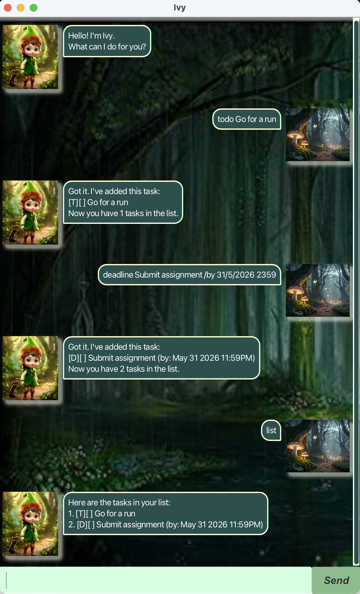

# Ivy User Guide



Welcome to Ivy! Ivy helps you add, track, and manage tasks 
like ToDos, Deadlines, and Events, freeing your mind of remembering 
things.

**Features**

- [x] Add tasks: ToDo, Deadline, Event
- [x] Mark tasks as done / not done
- [x] Delete tasks
- [x] List all tasks
- [x] Find tasks by keyword
- [x] Reminders

---

## Add Todos

Adds a simple task without a date or time to your task list.
<br> 
Ivy confirms the addition with a summary message.

Example: `todo Read a book`

Expected Output:
```
Got it. I've added this task:
[T][ ] Read a book
Now you have 2 tasks in the list.
```

## Add Deadlines

Add a task with a specific due date and time to your task list.
<br>
Ivy confirms the addition with a summary message.

Example: `deadline Submit report /by 31/5/2026 2359`

Expected Output: 
```
Got it. I've added this task:
[D][ ] Submit report (by: May 31 2026 11:59PM)
Now you have 1 tasks in the list.
```

## Add Events

Add a task with a start date and time and end date and time to your task list.
<br>
Ivy confirms the addition with a summary message.

Example: `event Gathering /from 31/5/2026 2000 /to 31/5/2026 2200`

Expected Output:
```
Got it. I've added this task:
[E][ ] Gathering (from: May 31 2026 8:00PM to: May 31 2026 10:00PM)
Now you have 3 tasks in the list.
```

## Delete Tasks

Remove a task from your task list by specifying its task number.
<br>
Ivy confirms the deletion and shows the updated task count.

Example: `delete 2`

Expected Output:
```
Noted. I've removed this task:
[D][ ] Submit assignment (by: May 31 2026 11:59PM)
Now you have 2 tasks in the list.
```

## Mark/Unmark Tasks

Mark a task as done or unmark a task as not done yet.
<br>
Ivy confirms the action and shows the task.

Example: <br> `mark 1` <br>
`unmark 1`

Expected Output:
```
Nice! I've marked this task as done:
[T][X] Read a book
```
```
OK, I've marked this task as not done yet:
[T][ ] Read a book
```

## View TaskList

View all tasks currently in your task list. 
<br>
Ivy lists all tasks with their indices, type, status, description.
If the list is empty, Ivy shows a friendly message.

Example: `list`

Expected Output:
```
Here are the tasks in your list:
1. [T][ ] Read a book
2. [E][ ] Gathering (from: May 31 2026 8:00PM to: May 31 2026 10:00PM)
```

💡 Note:
The task number shown in the list (e.g., 1, 2, 3…) is the index used for commands such as `mark`, `unmark`, and `delete`.

## Search Tasks

Find tasks in your task list that contain a specific keyword in their description.
<br>
Ivy displays a list of matching tasks.

Example: `find book`

Expected Output:
```
Here are the matching tasks in your list:
1. [T][ ] Read a book
```

## View Upcoming Tasks

View tasks in the next 7 days based on their deadlines / event start times.
<br>
Ivy displays the list of upcoming tasks. 
If no upcoming tasks exist, Ivy shows a friendly message.

Example: `remind`

Expected Output:
```
Here are the upcoming tasks in your list:
1. [E][ ] Gathering (from: May 31 2026 8:00PM to: May 31 2026 10:00PM)
```
